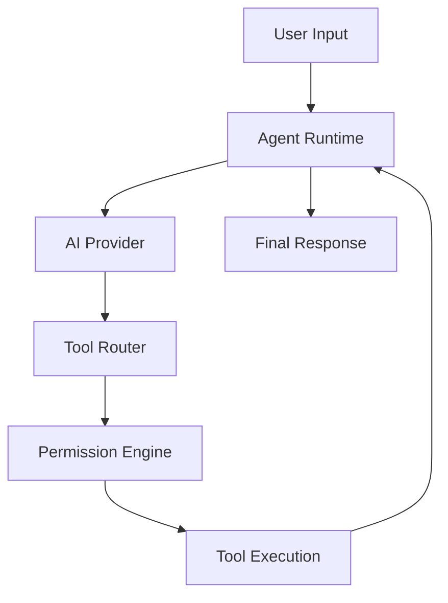

# KAHNA Architecture

KAHNA is a local AI computer agent designed with strict separation of concerns, ensuring deterministic tool execution, explicit contracts, and safe bounds.

## Core Pipeline

## Component Boundaries

### 1. Agent Runtime (`core/agent/`)
The orchestrator. It manages the conversational loop, stores session context, and delegates tasks to the AI provider and tool router.

### 2. AI Provider (`core/ai/`)
Abstracts away specific LLM providers. Currently uses OpenRouter. Converts provider-specific JSON into internal standard message models.

### 3. Tool System (`core/tools/`)
The deterministic layer for computer interaction. Contains the `ToolRegistry` and typed definitions for `ToolCall` and `ToolResult`.

### 4. Permission Engine (`core/security/`)
Acts as a gatekeeper. Before any tool is executed, it validates the tool's requested arguments against the tool's configured Risk Level and the current Session context.

### 5. Platform Abstraction (`platform/`)
Encapsulates all OS-specific behavior. `PlatformAdapter` defines the protocol for macOS and Windows implementations, hiding the `sys.platform` checks from the core.
